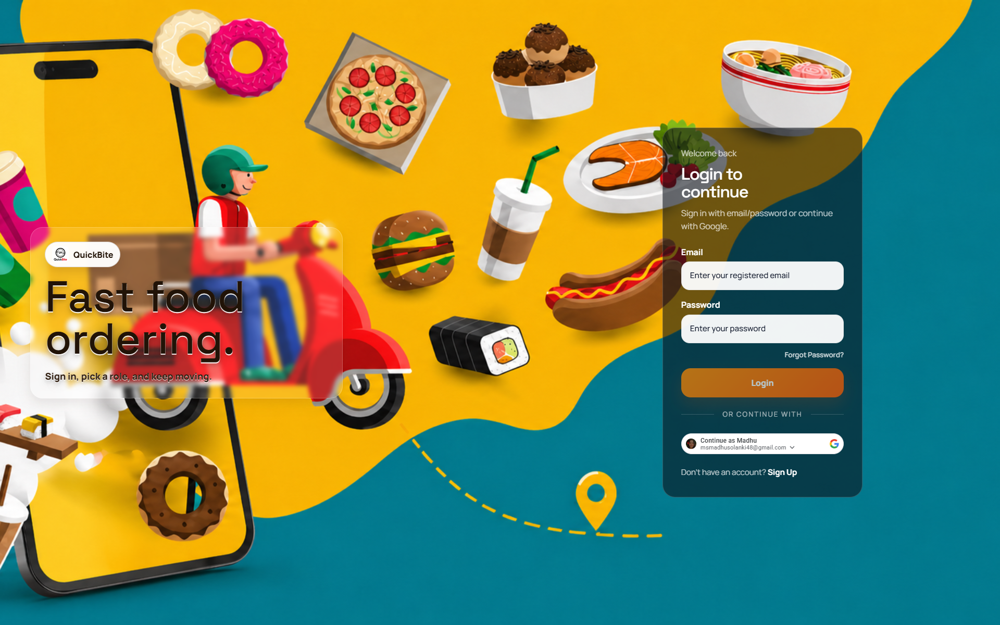
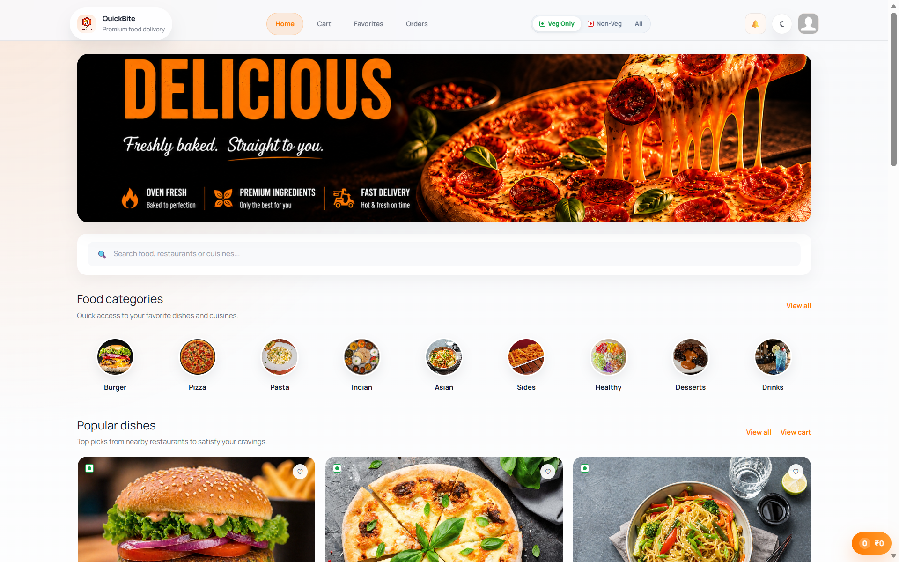
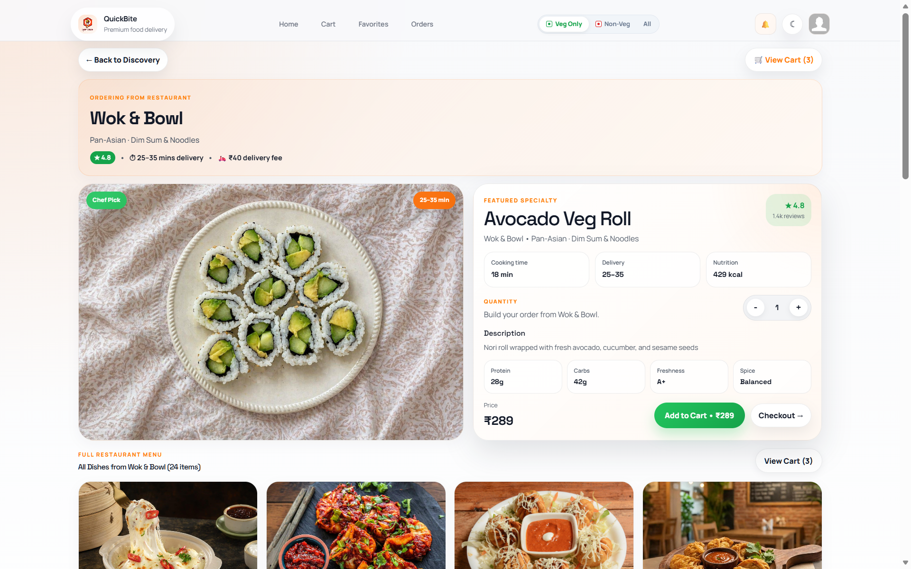
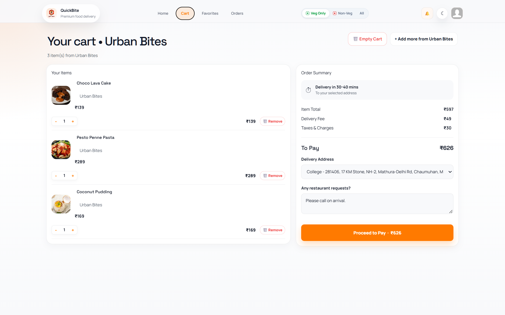
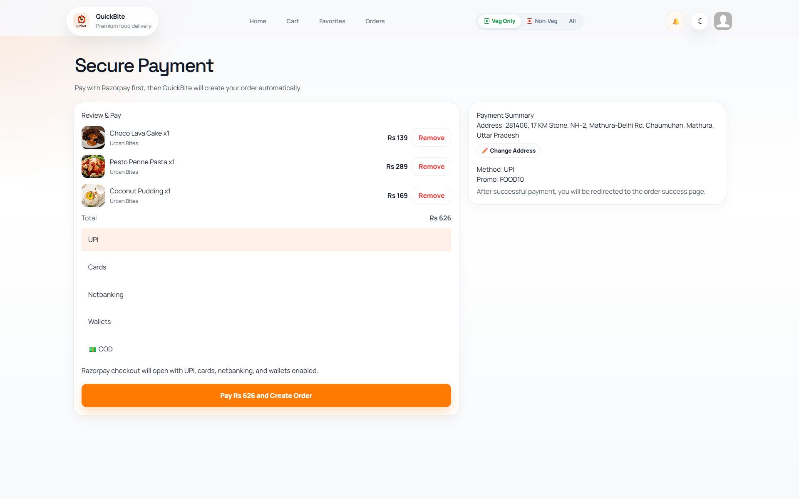
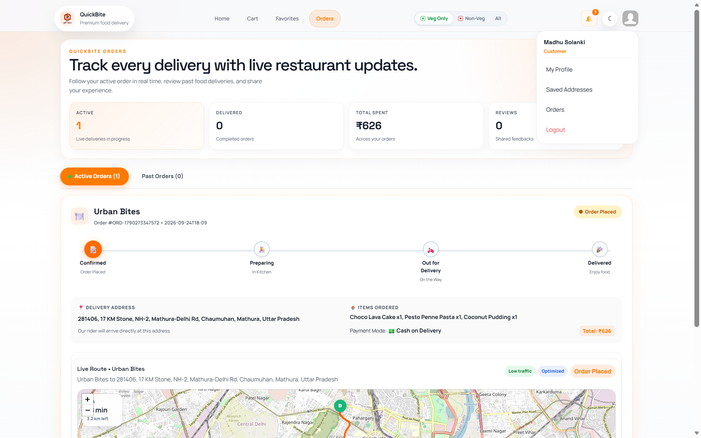
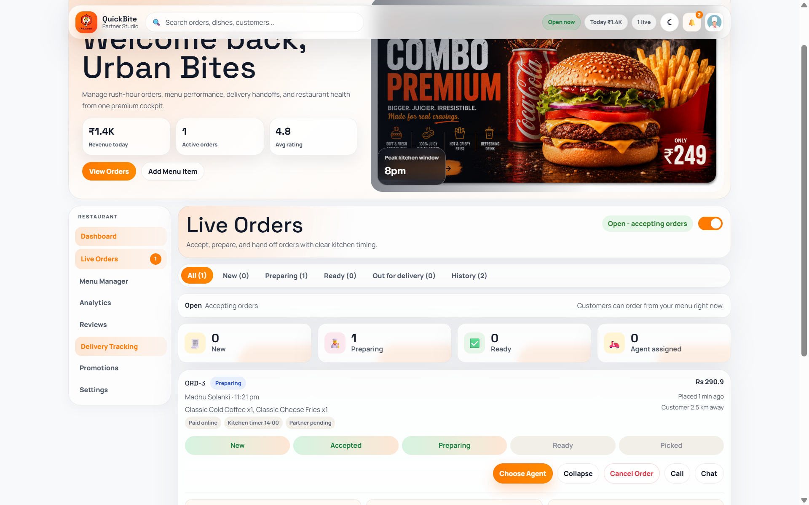
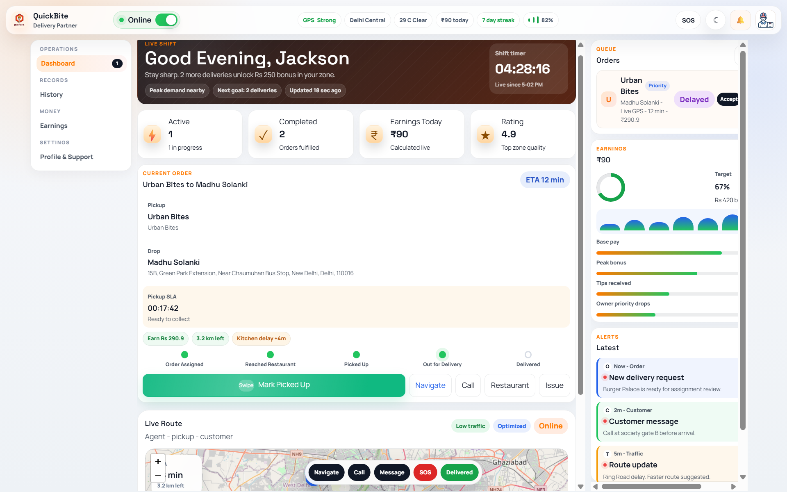
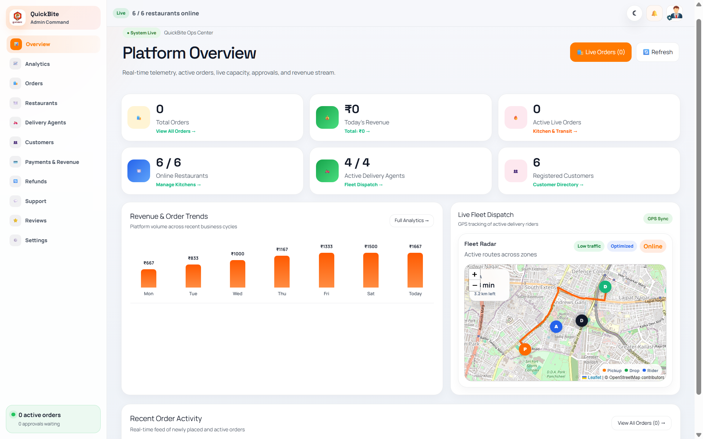
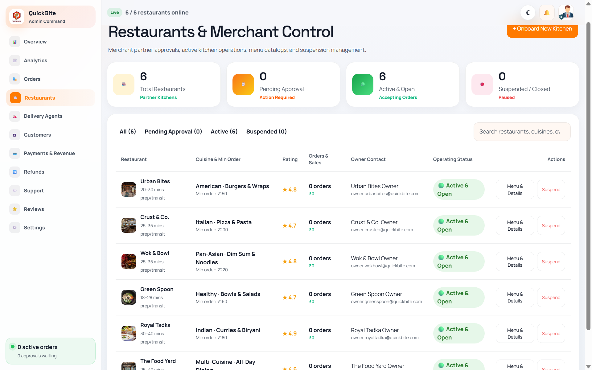

# QuickBite — Full-Stack Food Ordering & Delivery Platform

> **Final-Year Project / Academic Capstone**  
> A multi-role food ordering, kitchen management, and real-time delivery tracking platform built with **Angular 21 (Signals)**, **Spring Boot 3 Microservices**, **MySQL**, **RabbitMQ**, and **WebSockets**.

---

## 📸 Application Showcase

### 🔐 1. Multi-Role Authentication & Access Control
<p align="center">
  
</p>

- **Unified Sign-In**: Dedicated role-based login routing for Customer, Restaurant Owner, Delivery Partner, and Super Admin.
- **One-Tap Google OAuth 2.0**: Integrated seamless Google sign-in.
- **Pre-Seeded Credentials**: Demo accounts ready to log in immediately with `QuickBite@123`.

---

### 🍔 2. Customer Experience (Discovery to Live Delivery)

<p align="center">
  
</p>

| Restaurant Menu & Dish Selection | Interactive Cart & Discount Vouchers |
|:---:|:---:|
|  |  |

| Razorpay Online & Cash on Delivery | Real-Time Order Tracking |
|:---:|:---:|
|  |  |

---

### 👨‍🍳 3. Restaurant Owner Cockpit (Live Kitchen Orders)

<p align="center">
  
</p>

- **Live Orders Queue**: Real-time status tabs (`All`, `New`, `Preparing`, `Ready`, `Out for Delivery`, `History`).
- **Kitchen Actions**: One-click Accept, Start Preparing, Mark Ready, and Handover.
- **Rider Allocation**: Select available online delivery partners and assign them to orders.
- **Store Status**: Instant toggle between Open (accepting orders) and Closed.

---

### 🛵 4. Delivery Partner Portal (Live Dispatch & Earnings)

<p align="center">
  
</p>

- **Active Delivery Cards**: Immediate alert when an order is assigned by a restaurant.
- **Milestone Navigation**: Step-by-step progress tracking (`Pickup Order` → `Out for Delivery` → `Delivered`).
- **Rider Stats**: Distance calculations, estimated delivery times, and earnings per delivery.

---

### 👑 5. Super Admin Dashboard (Platform Governance)

| Overview Analytics & Metrics | Restaurant Partner Management |
|:---:|:---:|
|  |  |

- **Business Intelligence**: Gross revenue, order volume, active customer count, and delivery performance.
- **Merchant Management**: Onboard, verify, or suspend partner restaurants.
- **Refunds & Disputes**: Review order complaints and issue refunds.

---

## 📑 Table of Contents

- [About the Project](#-about-the-project)
- [Key Features by Role](#-key-features-by-role)
- [Tech Stack](#-tech-stack)
- [Login Credentials & Demo Accounts](#-login-credentials--demo-accounts)
- [How to Run the Project](#-how-to-run-the-project)
  - [Option A: Running Locally (Full Local Setup)](#option-a-running-locally-full-local-setup)
  - [Option B: Testing Live Vercel App with Local Backend (ngrok)](#option-b-testing-live-vercel-app-with-local-backend-ngrok)
- [Project Directory Structure](#-project-directory-structure)
- [Real-Time Sync Architecture](#-real-time-sync-architecture)

---

## 💡 About the Project

QuickBite is an end-to-end food delivery management system designed to simulate modern food platforms like Swiggy and Zomato. The frontend is built using **Angular 21** with **Standalone Components** and **Angular Signals** for reactive, performant state management without bulky external stores.

The system connects four distinct user personas into one unified application:
1. **Customers**: Browse menus, customize carts, save delivery addresses, and track orders.
2. **Restaurant Owners**: Receive orders live, manage kitchen preparation timers, and dispatch to riders.
3. **Delivery Partners**: Accept orders, navigate delivery milestones, and track daily earnings.
4. **Platform Admin**: Monitor analytics, manage restaurants, and handle refunds.

---

## 🛠 Tech Stack

| Layer | Technologies |
|---|---|
| **Frontend Framework** | Angular 21 (100% Standalone Components) |
| **State Management** | Angular Signals (`signal`, `computed`, `effect`) |
| **Styling & UI** | Vanilla CSS + Tailwind CSS v3 + Custom Design Tokens |
| **Real-Time Messaging** | `@stomp/stompjs` + WebSockets + 2s Reconciliation Polling |
| **HTTP & Networking** | Angular `provideHttpClient` with Functional Interceptors |
| **Route Security** | Role-Based Route Guards (`authGuard`, `partnerGuard`) |
| **Payments Integration** | Razorpay Checkout Web SDK + Cash on Delivery (COD) |
| **Authentication** | JWT Authentication + Google OAuth 2.0 |
| **Hosting & Cloud** | Vercel (Frontend) + ngrok (Gateway Tunnel) + Docker Compose (Backend) |

---

## 🔑 Login Credentials & Demo Accounts

All accounts come pre-seeded in the database. You can test all roles immediately without signing up:

### 👑 Super Admin
- **Email**: `admin@quickbite.dev` (or `admin@quickbite.com`)
- **Password**: `Admin@1234` (or `QuickBite@123`)

### 👨‍🍳 Restaurant Owners
- **Password for ALL Owners**: `QuickBite@123`

| Restaurant | Email | Associated ID |
|---|---|:---:|
| **Urban Bites** | `owner.urbanbites@quickbite.com` | `1` / `urban-bites` |
| **Crust & Co.** | `owner.crustco@quickbite.com` | `2` / `crust-and-co` |
| **Royal Tadka** | `owner.royaltadka@quickbite.com` | `3` / `royal-tadka` |
| **Wok & Bowl** | `owner.wokbowl@quickbite.com` | `4` / `wok-and-bowl` |
| **Green Spoon** | `owner.greenspoon@quickbite.com` | `5` / `green-spoon` |
| **The Food Yard** | `owner.foodyard@quickbite.com` | `6` / `the-food-yard` |

### 🛵 Delivery Agents
- **Password for ALL Agents**: `QuickBite@123`

| Agent Name | Email | Phone Number | Vehicle & Zone |
|---|---|---|---|
| **Jackson Ron** | `agent1@quickbite.com` | `+91 98765 00001` | Bike &bull; West Delhi |
| **Paul Weasely** | `agent2@quickbite.com` | `+91 98765 00002` | Scooter &bull; North Delhi |
| **Olive Mandy** | `agent3@quickbite.com` | `+91 98765 00003` | Electric Bike &bull; East Delhi |
| **Edward Ford** | `agent4@quickbite.com` | `+91 98765 00004` | Bike &bull; South Delhi |

### 👤 Customer
- **Email**: `customer@quickbite.com`
- **Password**: `QuickBite@123`

---

## 🚀 How to Run the Project

### Option A: Running Locally (Full Local Setup)

Use this setup when running both the frontend and backend microservices locally on your machine.

1. **Start the Backend Microservices (Docker):**
   ```bash
   cd QuickBite
   docker-compose up -d
   ```
   *(Ensure API Gateway is running on `http://localhost:8080`).*

2. **Install Frontend Dependencies:**
   ```bash
   cd QuickBite-Frontend
   npm install
   ```

3. **Start the Frontend Development Server:**
   ```bash
   npm start
   ```

4. **Open in Browser:**
   Visit `http://localhost:4200`. The frontend automatically proxies all `/api` requests to `http://localhost:8080`.

---

### Option B: Testing Live Vercel App with Local Backend (ngrok)

> **Why this setup?**  
> The QuickBite frontend is deployed on **Vercel** for easy demonstration. Because the microservices backend runs inside Docker on your local laptop, we use **ngrok** to tunnel requests from Vercel to your local API Gateway.

1. **Start your local backend containers:**
   ```powershell
   cd QuickBite
   docker-compose up -d
   ```

2. **Open the ngrok tunnel to port 8080 (API Gateway):**
   In a separate terminal, run:
   ```powershell
   .\ngrok.exe http --url=booth-salad-specimen.ngrok-free.dev 8080
   ```

3. **Open the Live Vercel App:**
   Open your deployed Vercel link in any browser:
   👉 **[quickbite-frontend.vercel.app](https://quickbite-frontend.vercel.app)**

> **How it works automatically**: The frontend code checks `window.location.hostname`. When running on Vercel (`*.vercel.app`), it automatically directs all API calls and STOMP WebSockets to the public tunnel `https://booth-salad-specimen.ngrok-free.dev/api`.

---

## 📂 Project Directory Structure

```
QuickBite-Frontend/
├── docs/                        # Screenshots & project artifacts
├── src/
│   ├── app/
│   │   ├── core/                # Data models, route guards, auth interceptor
│   │   │   ├── app.models.ts
│   │   │   ├── auth.guard.ts
│   │   │   └── auth.interceptor.ts
│   │   ├── layouts/             # Role-based layouts (Customer, Owner, Rider, Admin)
│   │   ├── pages/               # Feature pages
│   │   │   ├── auth/            # Login, Signup, OTP Verification
│   │   │   ├── customer/        # Home, Restaurant Menu, Cart, Payment, Orders
│   │   │   ├── owner/           # Live Orders, Menu Manager, Profile, Analytics
│   │   │   ├── delivery/        # My Deliveries, Onboarding, Route Tracking
│   │   │   └── admin/           # Admin Cockpit, Restaurants, Agents, Refunds
│   │   └── services/            # Reactive business logic & backend integrations
│   │       ├── cart.service.ts
│   │       ├── order.service.ts
│   │       ├── owner-dashboard.service.ts
│   │       ├── realtime-order-socket.service.ts
│   │       └── session.service.ts
│   ├── environments/            # Dynamic API host resolver (localhost vs ngrok)
│   └── styles.scss              # Global design system & theme variables
├── proxy.conf.json              # Local reverse proxy configuration
└── vercel.json                  # Vercel SPA routing configuration
```

---

## 🔄 Real-Time Sync Architecture

```
Customer Checkout (Edge) ──▶ POST /api/orders ──▶ MySQL Database
                                                        │
                         ┌──────────────────────────────┴──────────────────────────────┐
                         ▼                                                             ▼
           STOMP WebSocket Dispatch                                       2-Second Polling
      (ws://.../api/orders/ws)                                      (Background reconciliation)
                         │                                                             │
                         └──────────────────────────────┬──────────────────────────────┘
                                                        ▼
                                        Orders updated in OrderService
                                                        │
                      ┌─────────────────────────────────┼─────────────────────────────────┐
                      ▼                                 ▼                                 ▼
              Customer Dashboard                 Owner Dashboard                   Delivery Agent
             Status: 'Confirmed'                Status: 'New (1)'               Status: 'Assigned'
```

---

## 📜 Available Scripts

- `npm start`: Runs the Angular development server on `http://localhost:4200`.
- `npm run build`: Generates the production bundle in `dist/frontend/browser/`.
- `npm test`: Runs Karma unit test cases.

---

## 🤝 Project Credits

Developed as a college final-year capstone project demonstrating microservices architecture, modern frontend reactive patterns, and real-time distributed workflows.
